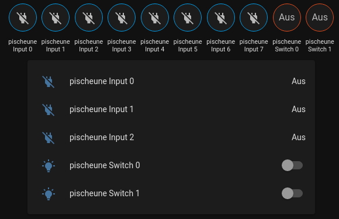
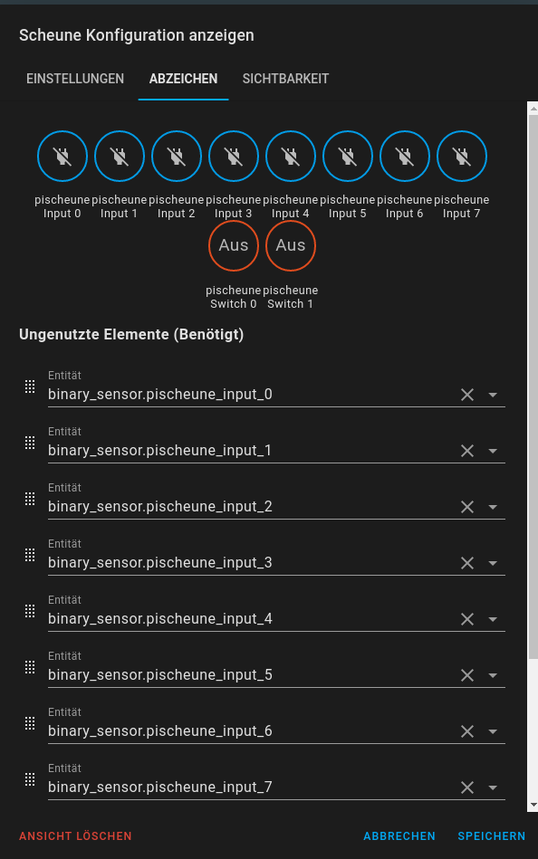

# ckw-ha-mqtt

Schickt PiFace Digital Daten via mqtt an einen mqtt-Broker und man kann somit via 
Homeassistant den Raspi steuern bzw. den Status der Ports abfragen. 

Für Python 3.x

# Vorarbeiten

## Hardware

- Raspberry Pi 1
- PiFace Digital

## Software

- Raspberry Pi OS auf SD-Karte
- SD-Karte in PC > leere "ssh"-Datei in boot-Partition erstellen
- Python 3.x

# Installation auf Raspberry Pi 1

## Konfiguration Raspi

```
sudo raspi-config
```

- Network Option > Hostname > "pischeune"
- Interfacing Options > SPI > enable
- reboot

### Installation Softwarepakete

```
sudo apt install screen git python3-pip
sudo pip3 install pifacecommon
sudo pip3 install pifacedigitalio
sudo pip3 install paho-mqtt
sudo pip3 install gpiozero
```

### Installation ckw-ha-mqtt

```
mkdir ~/src/
cd ~/src/
git clone https://github.com/ckarrie/ckw-ha-mqtt
```

### Start und Parameter

```
python3 ~/src/ckw-ha-mqtt/mqtt.py -i <IP Adress of MQTT broker> -t <MQTT root opic>
```

- `-i` = IP-Adresse des MQTT-Brokers (z.B. mosquitto), Default ist `192.168.178.71`
- `-t` = Wurzel-Topic der MQTT-Message, Default ist `winden`
- `-n 0,1,2,3,...` = Numerischer Zustand der Sensoren z.B. -n 0,1,2,3 liefert einen numerischen Wert (%) 
  ist z.B. 0=True und 1, 2 und 3=False, wird 25% zurückgeliefert

### Autostart mit `screen`

- `crontab -e`
- Add

    `@reboot  sleep 60 && /usr/bin/screen -dmS py_mqtt python3 /home/pi/src/ckw-ha-mqtt/mqtt.py -i 192.168.178.71 -t myhomename`
    
- Mittels `screen -r py_mqtt` kann nun direkt auf die `screen`-Instanz zugegriffen werden (Debugging, Live-Logs)

### Tests

```
python3 ~/src/ckw-ha-mqtt/test_piface.py
```

- Press a button (input button) on the PiFace Digital board to get messages like:

    ```
    pi@pischeune:~ $ python3 test_piface.py 
    [2020-12-02 14:29:12.932129] Switch 0 pressed
    [2020-12-02 14:29:15.339102] Switch 0 released
    [2020-12-02 14:29:18.342504] Switch 2 pressed
    [2020-12-02 14:29:18.959153] Switch 2 released
    [2020-12-02 14:29:21.842271] Switch 1 pressed
    [2020-12-02 14:29:22.525871] Switch 1 released
    [2020-12-02 14:29:25.063868] Switch 3 pressed
    [2020-12-02 14:29:26.353478] Switch 3 released
    ```
  
### Troubleshooting

Der Prozess bricht mit `Ctrl-C` nicht ab, daher muss er in einem neuen Terminal mitels `killall -9 python3` gekilled werden
    
## Integration in Homeassistant

Der Input-Status steht nun als `binary_sensor` zur Verfügung, z.B. falls der Hostname vom Rasperry
"pischeune" ist, steht nun die Entität `binary_sensor.pischeune_input_0` für Input 0 bereit.

### Entities-Card

```yaml
cards:
  - type: entities
    entities:
      - entity: binary_sensor.pischeune_input_0
      - entity: binary_sensor.pischeune_input_1
      - entity: binary_sensor.pischeune_input_2
      - entity: switch.pischeune_switch_0
      - entity: switch.pischeune_switch_1
```


### Abzeichen

